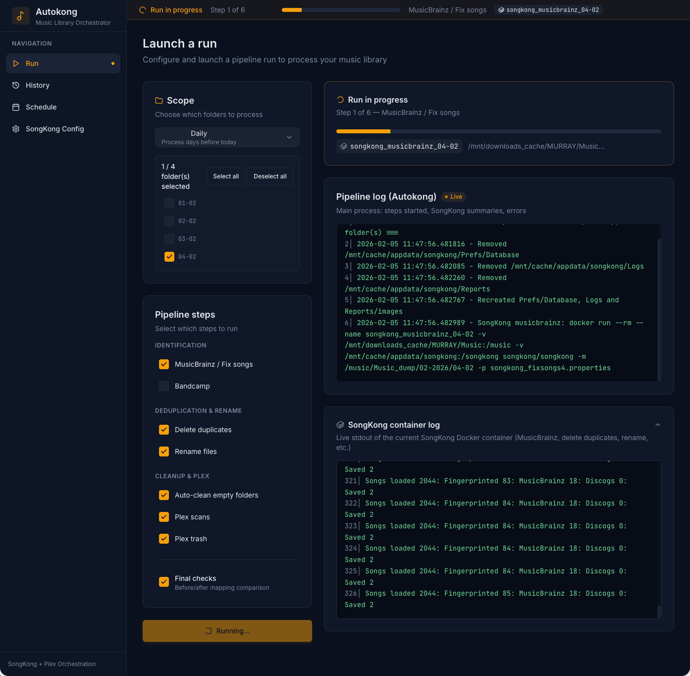
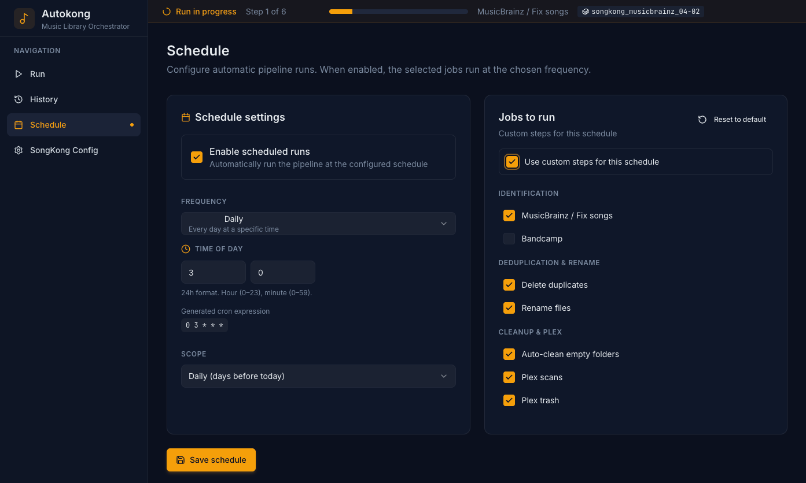

<p align="center">
  
</p>

# Autokong – Automate SongKong and keep Plex in sync

**Autokong** is a companion for [SongKong](https://www.jthink.net/songkong/) that:

- runs SongKong **automatically on your “inbox” folders** (MusicBrainz, Bandcamp, delete duplicates, rename),
- moves/renames the matched albums into a clean library,
- triggers **Plex** scans and optional trash emptying,
- gives you a **Web UI** to run the pipeline manually, schedule jobs, configure SongKong profiles and paths, and inspect detailed audit reports (before/after mapping, “albums with holes”, etc.).

Autokong itself runs in Docker and talks to:

- the Docker daemon (to start SongKong containers),
- your music folders,
- your SongKong `Prefs` directory,
- an optional Plex server.

---

## TL;DR: run it with Docker

Use the published image `meaning/autokong:latest` and bind the three critical things:

- **Docker socket** – so Autokong can start SongKong containers.
- **Music root** – the root of your music tree (dump + matched).
- **SongKong config** – where SongKong stores its `Prefs/` and `Logs/`.
- **Autokong data** – where Autokong stores its SQLite DB and settings.

```bash
docker run -d --name autokong \
  -p 5000:5000 \
  -v /var/run/docker.sock:/var/run/docker.sock \
  -v /path/to/your/music:/mnt/downloads_cache/MURRAY/Music \
  -v /path/to/songkong:/songkong \
  -v autokong_data:/app/data \
  meaning/autokong:latest
```

Replace:

- `/path/to/your/music` with the host path that contains:
  - your **dump** area (daily/monthly folders Autokong will process),
  - your **matched** library.
- `/path/to/songkong` with the host path that SongKong uses as `/songkong` (it must contain `Prefs/`, `Logs/`, `Reports/`).

The container exposes the Web UI on `http://<HOST_IP>:5000`.

---

## How it works – high level

1. **You configure SongKong first**
   - Run SongKong manually once (outside Autokong) to create and tune your profiles:
     - `songkong_fixsongs4.properties` (MusicBrainz / Fix songs),
     - `songkong_bandcamp.properties`,
     - `songkong_deleteduplicates.properties`,
     - `songkong_renamefiles.properties`.
   - Those files live in `Prefs/` under the directory you mounted to `/songkong` in Docker.

2. **Then you start Autokong**
   - Autokong discovers your SongKong `Prefs` directory (or you point it to the right place).
   - It uses the Docker socket to launch **SongKong containers** with the right `-p` (profile) and `-m/-e/-d/-f` flags.

3. **You configure the pipeline from the Autokong Web UI**
   - Choose which steps to run (MusicBrainz, Bandcamp, delete duplicates, rename).
   - Choose the “scope” (daily / monthly / all days) and which source folders to process.
   - Map Plex to the same library so runs can end with proper library refreshes.

4. **Autokong runs the pipeline**
   - For each folder in scope:
     - cleans SongKong DB/logs between passes,
     - runs SongKong with the selected profiles,
     - runs the rename/move phase,
   - Periodically:
     - cleans empty album directories,
     - triggers Plex scans and optionally empties the Plex trash.
   - Optionally, it collects **before/after snapshots** of the filesystem and generates an audit:
     - files added/removed/renamed,
     - tags changed,
     - albums with missing tracks (“holes”).

Everything is driven either **manually** from the Run page or by the **integrated scheduler** (no system cron required).

---

## Features

- **SongKong pipeline automation**
  - MusicBrainz / Fix Songs.
  - Bandcamp pass.
  - Delete duplicates (using your dedicated SongKong profile).
  - Rename / move files into your final library structure.
  - Automatic cleanup of empty directories.

- **Web UI**
  - Run page with:
    - scope selection,
    - folder preview and per-folder selection,
    - step toggles,
    - live pipeline logs,
    - live SongKong container logs,
    - summary and optional audit report.
  - History page listing recent runs with status and summary.
  - Schedule page: cron-like configuration via a visual time/day selector.
  - SongKong Config page:
    - lists `.properties` profiles found in `Prefs`,
    - lets you assign which profile is used for each step,
    - provides an editor for the `.properties` files,
    - configures host paths (music roots, dump folders) and Plex options.

- **Audit and safety**
  - Optional **before/after snapshot** of the processed areas.
  - Report of:
    - files deleted (by SongKong or rename),
    - files renamed/moved,
    - albums with missing tracks, ignoring “false holes” that are only due to tag splits
      (tracks moving from `Artist` to `Artist feat. Someone` but still present on disk).
  - Old “final clash cleanup” / “remove incomplete” scripts that aggressively deleted files
    have been removed from the pipeline. Deletion is controlled solely by **SongKong Delete Duplicates**.

- **Plex integration**
  - Stores Plex URL, token, section ID, and path mappings (unmatched/matched).
  - Can trigger library refreshes for new/updated folders on both dump and matched sides.
  - Can optionally empty the Plex trash after scans.

---

## UI overview

### Run page – full pipeline with live logs



The Run page lets you:

- choose the scope and exact folders to process,
- enable/disable each SongKong step (MusicBrainz, Bandcamp, delete duplicates, rename, cleanup & Plex),
- see a progress card for the current step/folder,
- follow the **Autokong pipeline log** and the **SongKong container log** in real time,
- inspect a summary (and audit report if enabled) once the run is finished.

### Schedule page – cron made visual



The Schedule page lets you:

- enable automatic runs,
- pick a **daily / weekly / monthly** frequency and configure time of day with numeric pickers,
- optionally use a raw cron expression for advanced cases,
- choose the steps and scope for scheduled runs,
- see the generated cron expression and the next planned run time.

---

## Configuration walkthrough (wiki-style)

### 1. Prepare SongKong

1. Install and run SongKong in Docker (or on the host).
2. In SongKong’s Web UI, configure and run each task **once** on a test album:
   - Fix Songs (MusicBrainz),
   - Bandcamp,
   - Delete Duplicates,
   - Rename Files.
3. Confirm that the corresponding `.properties` files exist under:

```text
/path/to/songkong/Prefs/
  ├─ songkong_fixsongs4.properties
  ├─ songkong_bandcamp.properties
  ├─ songkong_deleteduplicates.properties
  └─ songkong_renamefiles.properties
```

These are what Autokong will use.

### 2. Start Autokong (Docker)

Run:

```bash
docker run -d --name autokong \
  -p 5000:5000 \
  -v /var/run/docker.sock:/var/run/docker.sock \
  -v /path/to/your/music:/mnt/downloads_cache/MURRAY/Music \
  -v /path/to/songkong:/songkong \
  -v autokong_data:/app/data \
  meaning/autokong:latest
```

Then open `http://<HOST_IP>:5000` in your browser.

### 3. Configure paths and SongKong profiles

From the **SongKong Config** page:

1. **Confirm the SongKong Prefs path**
   - Autokong can discover it by inspecting a running SongKong container (`/songkong` mount).
   - Otherwise, set it manually (e.g. `/songkong/Prefs`).

2. **Assign profiles to pipeline steps**
   - For each step (MusicBrainz, Bandcamp, Delete duplicates, Rename), pick the `.properties` file you want from the drop-down.
   - Save the configuration.

3. **Configure paths**
   - Set the **host music root**: this should match what you mounted to `/mnt/downloads_cache/MURRAY/Music` in the Docker command.
   - Optionally, set:
     - main dump folder (e.g. `/mnt/downloads_cache/MURRAY/Music/Music_dump/<month-year>`),
     - additional starting folders (one per line) if you have multiple “inboxes”.

4. **Configure Plex (optional but recommended)**
   - Enter the Plex URL (e.g. `http://192.168.3.2:32400`) and token.
   - Click “Load libraries from Plex”, pick the correct **Music library** (section ID is saved).
   - Configure:
     - “Dump path in Plex” (e.g. `/music/unmatched`),
     - “Matched path in Plex” (e.g. `/music/matched`).

### 4. Manual runs

From the **Run** page:

1. Choose a **scope**:
   - `daily` – yesterday’s dump folders,
   - `monthly` – the whole current month,
   - `all_days` – all detected subfolders in the dump area.
2. Autokong shows a **preview** of folders that would be processed; you can include/exclude them.
3. Choose which **steps** to run:
   - You can disable Bandcamp, Delete duplicates, or Rename if you want a lighter run.
4. Optionally enable **Final checks** to run the before/after audit.
5. Click **Launch run**.
6. Watch:
   - the main pipeline log,
   - the live SongKong container log,
   - progress (per-step, per-folder).

When the run finishes, you’ll see a **summary** and, if audit is enabled, an **audit report** listing deleted files, renames, and albums with holes.

### 5. Scheduling

From the **Schedule** page:

1. Enable **scheduled runs**.
2. Pick a **frequency**:
   - Daily, Weekly, Monthly, or custom cron.
3. For Daily/Weekly/Monthly:
   - Use the time and day pickers to generate the cron expression visually.
4. Optionally choose **custom steps** for the scheduled pipeline; otherwise, it will use the same steps as your default configuration.
5. Save. The integrated scheduler (APScheduler) will:
   - run the pipeline according to the cron expression,
   - track runs in the same history,
   - never require an external cron on the host.

---

## API endpoints

For advanced users or API clients:

- `GET /api/health` – basic environment checks (music root, dump dir, SongKong Prefs).
- `GET/POST /api/config` – get or update configuration (steps, scope, audit, paths, SongKong/Plex prefs).
- `POST /api/run` – start a pipeline run:
  - body: `{"steps": [...], "scope": "daily|monthly|all_days", "enable_audit": true|false, "folders": [...]}`.
- `GET /api/job/current` – returns the current job id and progress.
- `GET /api/job/<id>` – job summary.
- `GET /api/job/<id>/log` – pipeline log.
- `GET /api/job/<id>/container-log` – saved SongKong container log.
- `GET /api/job/<id>/audit` – audit report JSON (if audit was enabled).
- `GET /api/history` – last 100 runs.
- `GET/POST /api/schedule` – get or update scheduling settings.
- `GET /api/songkong-config/list` – list `.properties` files in Prefs.
- `GET /api/songkong-config` – read `.properties` content (single or all).
- `PUT /api/songkong-config` – save a `.properties` file (file name + content).
- `GET /api/songkong-config/discover` – detect the Prefs path from a running SongKong container.
- `GET /api/preview?scope=...` – show which folders would be processed for a given scope.

---

## Development

Local development (without Docker):

1. Backend (Flask):

```bash
pip install -r requirements.txt
python app.py  # serves API + static build on :5000
```

2. Frontend (Vite + React):

```bash
cd frontend
npm install
npm run dev        # Vite dev server, proxies /api to :5000
npm run build      # production build used by Docker image
```

Optional environment variables:

- `AUTOKONG_DATA_DIR` – where to store `settings.db` and `runs.db` (default: `/app/data` inside the container).
- `SONGKONG_CONFIG_DIR` – base path of SongKong config on the host (default: `/mnt/cache/appdata/songkong`):
  - Prefs are expected under `$SONGKONG_CONFIG_DIR/Prefs`.
- `AUTOKONG_CONFIG_PATH` – legacy JSON config path, now superseded by `settings.db` (kept for migration).

---

## Safety notes

- Autokong itself **does not delete files directly**; it delegates this to SongKong’s **Delete Duplicates** profile.
- The old ad‑hoc cleanup scripts that removed “clash” files or “incomplete” albums have been removed from the pipeline to avoid creating holes.
- Always test your SongKong profiles on a small subset of your library and keep backups, especially when enabling Delete Duplicates or aggressive rename rules.

Use Autokong at your own risk: it is a powerful automation layer on top of an already powerful tagging tool. Take the time to understand your configuration before running it on your entire collection. 
